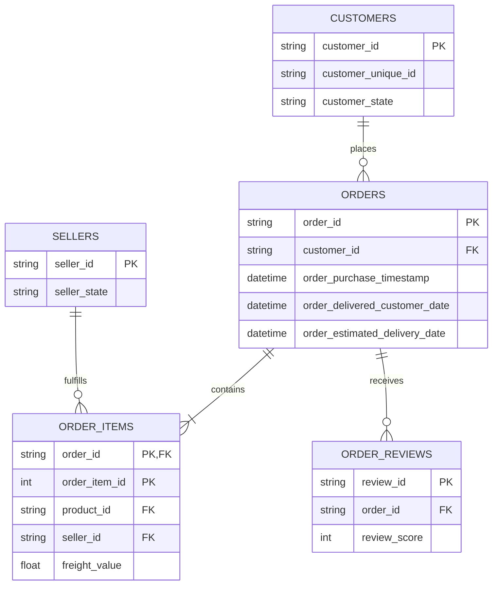

# Olist Delivery Performance & Retention Analysis

## Business Question
**Which sellers and regions are underperforming on delivery time, and how is that impacting review scores and repeat-purchase behavior?**

**Answer:** The logistics routes from Maranhão to São Paulo (`MA to SP`) and Rio de Janeiro to Ceará (`RJ to CE`) suffer from a nearly 25% late delivery rate driven by carrier bottlenecks. This drags average review scores down to ~3.6 and reduces customer repeat purchase rates by approximately 19%.

---

## Project Overview
This project is a clean, SQL-only analytical proof point using the Olist Brazilian E-Commerce Public Dataset. It explores the relationships between logistics performance, customer satisfaction, and long-term retention. 

## Methodology
The analysis was conducted purely in standard SQL, querying 9 interconnected tables. Advanced SQL techniques utilized include:

*   **Multi-table Joins:** Tracing the path from customers to orders, items, sellers, and reviews.

*   **Window Functions (`ROW_NUMBER`, `COUNT`):** Used extensively for cohort analysis to isolate the exact impact of a customer's *first* delivery experience.

*   **Common Table Expressions (CTEs) & Self-Joins:** Used to stage complex logic, calculate running averages, and determine the time elapsed between sequential orders for repeat buyers.

*   **Data Validation:** Findings were manually spot-checked against raw row data to verify mathematical accuracy before synthesis.

## Database Schema (ERD)

## Repository Structure
*   `/sql`: Contains the numbered, sequential SQL queries used for the analysis.

*   `/docs`: Contains the final business recommendation ([findings_summary](docs/findings_summary.md)).

*   `/data`: The raw CSV files can be downloaded directly from [Kaggle](https://www.kaggle.com/datasets/olistbr/brazilian-ecommerce).
